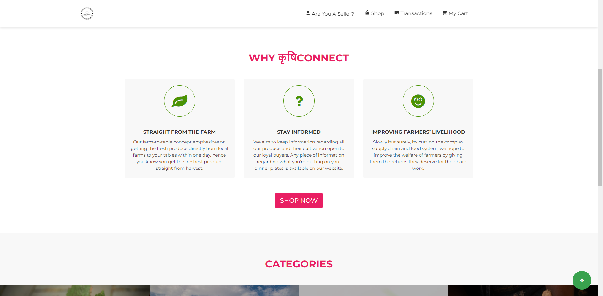

<h1 align="center">KrishiConnect  </h1>

<h1 align="center">Revolutionizing Agriculture Consumer Industry  </h1>

## 👇About KrishiConnect

**KrishiConnect** aims to transform the agricultural consumer industry by eliminating intermediaries that hinder our farmer friends from achieving the economic prosperity they deserve. Our website is meticulously designed to be aesthetically pleasing, interactive, and user-friendly for our clients.

## 🔥Key Features

- Empowering farmers by ensuring fair pay through the removal of middlemen.
- Providing information on government policies and agro-technology advancements to support farmers.
- Promoting sustainable farming practices through useful tips and resources.
- Offering services such as soil-testing, water-testing, etc., to enhance productivity.

## 🤔Why Choose KrishiConnect?

**KrishiConnect** prioritizes the satisfaction of all parties involved in agricultural transactions. By fostering direct connections between farmers and consumers, we facilitate transparent and mutually beneficial exchanges.

## 📌 Tech Stack

[](https://www.linkedin.com/in/yashpreeth-nijalinge-aa8a36214/) [](https://linkedin.com/)  [](https://twitter.com/) 

# 📸Screenshots

     

<!-- 


 -->

# 💻How to run the webpage on your local system

1.  Go to the `krishiconnect` directory.

```
cd krishiconnect
```

2.  Navigate to the index.html file and double click on it.

3.  It redirects to your browser and opens on the localhost of your system

```
file:<your folder location>/krishiconnect/index.html
```

4.  You are ready to explore the website of **KrishiConnect**.

# 🤝How to Contribute

If you think that you can add a new feature or want to fix a bug, we invite you to contribute to **KrishiConnect** and make this project better. To start contributing, follow the below instructions:

1.  Create a folder at your desire location (usually at your desktop).

2.  Open Git Bash Here.

3.  Create a Git repository.
    Run command `git init`
4.  Fork the [repository](https://github.com/Anushkabh/krishiconnect.git).

5.  Clone your forked repository of project.

```
git clone https://github.com/<your_username>/KrishiConnect.git
```

6.  Navigate to the project directory.

```
cd krishiconnect
```

7.  Add a reference(remote) to the original repository.

```
git remote add upstream https://github.com/Anushkabh/krishiconnect.git
```

8.  Check the remotes for this repository.

```
git remote -v
```

9.  Always take a pull from the upstream repository to your main branch to keep it updated as per the main project repository.

```
git pull upstream main
```

10. Create a new branch(prefer a branch name that relates to your assigned issue).

```
git checkout -b <YOUR_BRANCH_NAME>
```

11. Perform your desired changes to the code base.

12. Check your changes.

```
git status
```

```
git  diff
```

13. Stage your changes.

```
git add . <\files_that_you_made_changes>
```

14. Commit your changes.

```
git commit -m "relavant message"
```

15. Push the committed changes in your feature branch to your remote repository.

```
git push -u origin <your_branch_name>
```

16. To create a pull request, click on `compare and pull requests`.

17. Add an appropriate title and description to your PR explaining your changes.

18. Click on `Create pull request`.

Congratulations🎉, you have made a PR to the KrishiConnect. Wait for your submission to be accepted and your PR to be merged by a maintainer.

## 📩Contact Us

[](https://github.com/Anushkabh/krishiconnect?tab=readme-ov-file#contact-us)

For inquiries and support, please reach out to us at [info@krishiconnect.com](mailto:info@krishiconnect.com).

<hr>

<div>
  <h2 align = "center">Our Contributors</h2>
  <div align = "center">
 <h3>Thank you for contributing to our repository</h3>


### Show some ❤️ by starring this awesome repository!

</div>

© 2024 KrishiConnect. All rights reserved.
